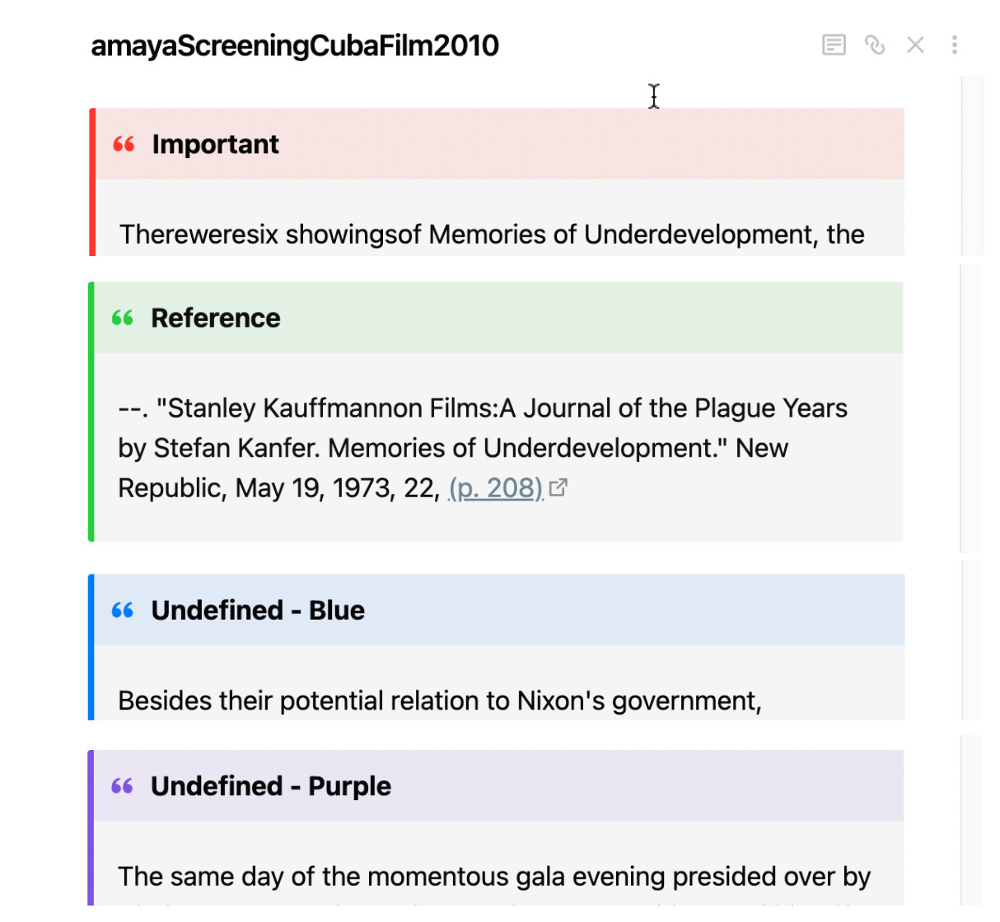

[Elena Razlogova](http://elenarazlogova.org/)  
History Department, Concordia University, Montreal  
elena.razlogova[at]concordia.ca


_Welcome to Doing History with Zotero and Obsidian! Learn more [[00 About the Project]], or read about the setup here in detail. You can also download a starter [Obsidian history vault](https://github.com/erazlogo/obsidian-history-vault) from Github which includes all Obsidian plugins, scripts, and settings described here. (Updated 2022-08-13)_

Notetaking is an essential aspect of research and writing. Historians in particular take notes on a grand scale: they process hundreds or thousands of primary sources when writing a book. You may start with index cards and a corkboard. But once you get into a major historical project you may be overwhelmed with sources and connections, and a corkboard will not be enough. Digital tools become crucial at that stage.

I chose Zotero and Obsidian for digital notetaking because they are free at the entry level, and their paid features are not expensive. Both apps have large and active user communities that support their development so they are not likely to disappear. Finally, their data is portable: Zotero can export all its data as plain-text files, and Obsidian data is basically a folder (called a "vault" in the app) of text files written in [markdown](https://en.wikipedia.org/wiki/Markdown), a simple markup language that creates formatted text in a plain-text file. Obsidian features such the local Graph (a map of connections between notes) and Dataview (a plugin that structures the text in my notes so they can be queried like a database) help analyze the information I collect.

I use Zotero to import source metadata and annotate PDFs, and Obsidian to work with notes. A popular way to do that among Obsidian users is to create one "literature note" per source with all annotations. But, as the above chart (based on a research process slide by historian [Zachary Schrag](https://zacharyschrag.com/)) shows, different annotations from the same source actually might belong in different places in your draft.

In order to make this work, I split annotations into several research notes that will be later sorted into groups for writing. I put them in the top folder in my Obsidian vault, "01 notes" and mark them up for further analysis. My research notes look like this (open in a new window for better view):


This note includes a title that summarizes the note (it doubles as the file name for the note), source information, text from the source, tags, Dataview fields I set up with data added by me, including my comments, and links to other notes (clickable text in blue reflected in the graph on the top left). Links between notes are a basic feature of Obsidian. They are created by encasing the title of the note in double square brackets: `[[note title here]]`. The "live preview" feature in Obsidian hides this formatting code for easier reading.

On the left you see my folder structure, recommended by the Obsidian community: seven folders for my research, and a "meta" folder. Starting each folder number with a leading "0" ensures correct sorting in case you have more than nine research folders in the root directory down the road. In the unnumbered "meta" folder, I save all supplementary files, including templates for importing and processing Zotero annotations. (It is important to keep different kinds of templates in separate subfolders, in order to specify these folders correctly in the Obsidian preferences.)

On the right you see the Graph view that allows me to browse linked notes and trace networks among people, events, institutions, and artworks. This is a key Obsidian feature allowing for [Zettelkasten](https://zettelkasten.de/introduction/) notetaking method. The backlinks feature (bottom right) lists all notes that link back to the current note.

Below I explain what you need to do to get to this point.

### What You Need to Install

Note: Obsidian plugins can be easily installed from within Obsidian (see directions below). Here I provide links to Github repositories where you can find out more about them.

[Zotero 6 and Zotero Browser Connector](https://www.zotero.org/download/)  
[Better Bibtex for Zotero](https://retorque.re/zotero-better-bibtex/) - Zotero plugin  
[Obsidian](https://obsidian.md/)  
[Zotero Integration](https://github.com/mgmeyers/obsidian-zotero-integration) (formerly Zotero Desktop Connector) - Obsidian plugin. **If your [Obsidian installer version](https://github.com/mgmeyers/obsidian-zotero-integration/blob/main/README.md#help-the-plugin-doesnt-load) is before v0.13.24 you will need to reinstall from [obsidian.md website](https://obsidian.md/) (rather than updating from within the app).**  
[Templater](https://github.com/SilentVoid13/Templater) - Obsidian plugin  
[Dataview](https://github.com/blacksmithgu/obsidian-dataview) - Obsidian plugin

### Zotero Annotations

I am skipping the installation of Zotero and its plugins here, as well as the basics of importing sources into Zotero, because these instructions are available widely on the web (for example, see relevant sections [here](https://github.com/erazlogo/zotero-markdown-translators) or [here](https://daily.jstor.org/how-to-use-zotero-and-scrivener-for-research-driven-writing/)) and many universities offer Zotero tutorials. I move on directly to the new (as of 2022) feature in Zotero 6: PDF annotations.

[Zotero's built-in PDF reader](https://www.zotero.org/support/pdf_reader), new in Zotero 6, adds annotations in a way that keeps them separate from the PDF. This setup requires you to keep your PDFs stored within the Zotero file system rather than as linked files residing elsewhere on your hard drive. I prefer this setup because it allows me to sync my files and annotations with the iOS Zotero app. I can share clean PDFs with my students, or I can export a PDF with annotations if desired. If you prefer to use linked PDF files, or to keep annotations embedded in PDFs and work in an external PDF editor you will need a different set of plugins.

I add as many Zotero items as I can via web connector:

  
I turn as many analog and electronic sources into OCRed PDFs as I can: articles, chapters, and books in scholarly databases, open-access books, scanned ILL materials, photographed archival sources, and converted EPUB files, DjVu files, and webpages.

  
I read PDFs in Zotero’s built-in PDF reader, make annotations--highlights and comments.

  
Now I am ready to import annotations into Obsidian.

### Zotero Integration Setup

The basics of installing Obsidian are also available on the web; see, for example, [my guidelines](https://github.com/erazlogo/obsidian-history-notes). Here I am focusing on how I import annotations with Zotero Integration ([requires Obsidian installer version v0.13.24 or later](https://github.com/mgmeyers/obsidian-zotero-integration/blob/main/README.md#help-the-plugin-doesnt-load)).

First, install Zotero Integration in the Community Plugins section. Turn "Safe mode" off. Then click on "Browse".


Search for the plugin, install, and activate it in the next window:


Set up Zotero Integration preferences (you don't need to install PDF Utility because you are extracting annotations directly from Zotero):

Select database: Zotero  
Note Import location: The folder where you will save annotations


Set up the Import format and name it. Specify your research notes output path (mine is "01 notes" folder). Specify Bibtex citekey (created by BetterBibtex in Zotero) as the file name. Set up image output path.


Specify the template file and path, saved as an .md (markdown) file in a separate folder in your vault (mine is "meta/zotero/research note.md"). Specify the bibliography style for the citation (Chicago note style for historians).


My template for a research note separates authors by type so I can use Dataview to search by letter recipient and interviewer. It includes a template for data entry, including fields for for page number, for my comments, and for the dates of an event described in the note. And in the very end it includes all highlights and comments I made in Zotero. (If you cut and paste this template from Safari into an Obsidian note, make sure to delete the accents before and after "---").

```
---
cssclass: research-note
type: "{{itemType}}"
{{type | replace("interviewee", "author") | replace("director", "author") | replace("presenter", "author") | replace("podcaster", "author") | replace("programmer", "author") | replace("cartographer", "author") | replace("inventor", "author") | replace("sponsor", "author")  | replace("performer", "author") | replace("artist", "author")}}: "{{creator.name}}{{creator.lastName}}, {{creator.firstName}}; "

title: "{{title}}"
publication: "{{publicationTitle}}"
date: {{date | format("YYYY-MM-DD")}}
archive: "{{archive}}"
archive-location: "{{archiveLocation}}"
citekey: {{citekey}}
---
{{bibliography}}
[online]({{uri}}) [local]({{desktopURI}})  [pdf](file://{{attachment.path | replace(" ", "%20")}})
 

 
#source/secondarysource/primaryproject/{{t.tag | lower | replace(" ", "-") | replace("-project", "")}}subject/{{t.tag | lower | replace(" ", "-")}}


### Index

start-date:: {{date | format("YYYY-MM-DD")}}
end-date::
page-no:: {{annotation.pageLabel}}

### Connections

comment:: 

### Note


Important


Reference


Undefined - Blue


Undefined - Purple






### Imported on {{importDate | format("YYYY-MM-DD h:mm a")}}



>[!quote|{{annotation.color}}] {{calloutHeader(annotation.color)}}
>
![[{{annotation.imageRelativePath}}]] 
{{annotation.annotatedText}} [(p. {{annotation.pageLabel}})](zotero://open-pdf/library/items/{{annotation.attachment.itemKey}}?page={{annotation.pageLabel}}&annotation={{annotation.id}})
%%{{annotation.comment}}%% 
```

The template above imports all tags attached to the Zotero item, separated by line breaks. Zotero allows for spaces in tags, but Obsidian does not, so the template replaces spaces between words with dashes. The template converts your tags to nested "subject" tags: [#subject/zotero-tag](https://publish.obsidian.md/#subject/zotero-tag).

This template also helps to categorize notes by type or source and project. It converts tag "secondary" to [#source/secondary](https://publish.obsidian.md/#source/secondary) and tag "primary" to [#source/primary](https://publish.obsidian.md/#source/primary). In Zotero, you can add "-project" in the end of any tag that denotes a research project. The template will convert Zotero tag "your-article-project" to Obsidian tag [#project/your-article](https://publish.obsidian.md/#project/your-article).

If you do not care about importing annotations in different colors, just use the yellow highlight in Zotero. The yellow highlight will be imported as regular text. You can move on to the next section. If you do want to import the highlight colors, you need to change a few more settings in Obsidian.

First, open the "snippets" folder in `your-vault/.obsidian/snippets` (on a Mac, first press `Shift-Cmd-.` to make hidden folders visible).

Create a text file called `callouts.css` and place it in the `snippets` folder:

```
/* Yellow */
.research-note .callout[data-callout-metadata="#ffd400"] {
  --callout-color: 255, 204, 0;
}

/* Red */
.research-note .callout[data-callout-metadata="#ff6666"] {
  --callout-color: 255, 59, 48;
}

/* Green */
.research-note .callout[data-callout-metadata="#5fb236"] {
  --callout-color: 40, 205, 65;
}

/* Blue */
.research-note .callout[data-callout-metadata="#2ea8e5"] {
  --callout-color: 0, 122, 255;
}

/* Purple */
.research-note .callout[data-callout-metadata="#a28ae5"] {
  --callout-color: 125, 84, 222;
}
```

Now go to Settings -> Appearance and activate the snippet.


Now any highlight other than yellow will be imported as a "callout" in color:

  
To add your own headings to these callouts, just find the `calloutHeader` settings in the template and change the settings to suit your needs.

Zotero Integrator will name your import note according to your Zotero item's citekey (`amayaScreeningCubaFilm2010`, for example). If you keep this note with the same name, subsequent annotations you make will be placed into a separate section on second import, at the bottom of the note, preceded by the new import date.


All the changes you made to the original import (for example, if you extracted and linked several atomic research notes) will remain intact. This helps when you are working with books or other long pdfs that you have to read and annotate repeatedly. If you don't need this feature, just rename or delete the original note--that is best for short sources or sources you do not have to read repeatedly.

### Importing Annotations

Once you set up this system, import is easy. I set up a shortcut (Cmd-R) to call up the template, but you can also use the command palette. The command palette icon appears by default in the left-hand bar. To turn it off and on, go to Core Plugins in Settings. To call it up with a shortcut, type Cmd-P on Mac (Ctrl-P on PC).


Choose "Create research note."  
  
Then type keywords to find the source:  


And Zotero Integration will add the note that already has tags (in my case, for type of source and project). It will also automatically place the source date (publication date in this case) into the "start-date" field. Change it manually if the date of the event the note describes is different from the source date. Always having the start-date field defined will help proper sorting of notes down the road. (I explain below how to search and sort your research notes.) If you write in Scrivener or Ulysses and use footnote styles you may prefer to [[Option - Import Annotations with Footnotes|import annotations with a citation instead of a bibliographic reference]].

You will need to create a descriptive title instead of the default title based on the BibTex citekey.


Everything below the "Note" heading is your note made from annotations. If I did have any other notes attached to this source in Zotero they would import as well. To keep things organized, I don't keep notes of any kind in Zotero. After I import annotations, I delete "note from annotations." This way my notes are only in one place.

The imported data I get falls into four categories:

1. Zotero Item metadata without annotations: If I am working with an analog source (an archival source I am not allowed to photograph, for example) and need to enter notes by hand, I just make sure there are no notes attached to the Zotero item. Then the import includes only source metadata and a template for entering the note.
    
2. Annotations relate to the same point or topic: If I have a short source that only requires one research note, after import I only have to rename the note in a way that describes its content. One note is all I need.
    
3. Annotations relate to several points or topics: If the annotations will have to be put into different parts of my draft (see Zachary Schrag's chart above), I will need several research notes. I process the data further.
    
4. Annotations are citations or bibliography entries: anything in footnotes or bibliography that belongs in my Zotero database. I need to process them as well: add them to Zotero.
    

### Processing Imported Annotations

The Templater plugin helps to extract any selected text (one annotation or several consecutive annotations) into a new research note with one keyboard shortcut. First, install Templater from the Community plugins section in the Settings. Then, create two folders for templates and add them to Templater preferences. One folder is for Templater files:


The other folder is for javascript code that will be embedded into the templates:


In the "meta/templater" folder, place "extract research note from selection.md" file with this text:

```
<%*
const fileName = await tp.system.prompt("New Note Title");
tp.file.create_new(tp.user.header(tp)+tp.file.selection(), fileName, false);
await tp.file.cursor_append("[["+fileName+"]]");
%>
```

In the "meta/javascript" folder, place "header.js" file with this text:

```
function header(tp) {
    content=tp.file.content;
    selection=tp.file.selection();
    getheader=content.substring(0, content.indexOf("### Note")+10);
    pageno=selection.substring(selection.indexOf("?page=")+6, selection.indexOf("&annotation"));
    headerwithpageno=getheader.replace("page-no::", "page-no:: "+pageno);
     return headerwithpageno;
}
module.exports = header
```

(Obsidian can't open .js files and does not display them by default. If you want to see them in Obsidian, turn on "Detect all file extensions" in Settings -> Files and Links.)

Now you need to set up keyboard shortcuts in Settings. First, add the new .md file to Templater preferences:


Then choose the keyboard shortcut in the Hotkeys section:


You can choose any available key combination. I chose Cmd-Z as a hotkey.

Now, you can select any text in your note imported from Zotero and press the Cmd-Z hotkey. You will see the prompt where you can type the title for your new note. The new research note will have research metadata, tags, and the note template, the text you selected, and the page number for the annotation in the "page-no" field. You will also see the link to the new note in the original imported note, for easy navigation.


You can also use Templater to [[Option - Create a Task Note from Imported Zotero Annotations|move one or several references you imported into a separate "task" note]], for adding to Zotero later.

### Research Note Details

My template puts source metadata on the top into the "YAML" space, denoted by three dashes on top and bottom. This data can go anywhere in a note but I like to hide it because I only need it to create Dataview searches and to connect from Zotero back to Obsidian. YAML allows it to be hidden, either with an arrow in the "editing" view, or completely in the "reading" view. I prefer to see the formatted bibliographic entry instead.


I add a descriptive title to the note and my own metadata: tags, page number, events, people, or other entities (films in my case), links to other related notes, my own comments, and, if necessary, the dates of the main event the note describes. The text ending with a double column `::` is a field name (in YAML you only need one `:`); everything to the right of `::` is field data. I show below how to aggregate these fields into a table. The local graph displays the links I create:


Each imported annotation comes with the link back to the annotation in the PDF:


Even if you entered your notes manually and don't have a pdf attached, you'll still be able to get to the Zotero item from the "local" link after your bibliographic reference:


You can also [[Option - Link from a Zotero item back to related notes in Obsidian|link from a Zotero item back to related notes in Obsidian]].

### Search Research Notes

Structuring my notes allows me to keep track of my research. The regular Obsidian search (use the magnifying glass on the top left) works well for other notes, but you need to be able to search your research notes by source fields, event dates, and even keyword:


Check out [[03 Search Research Notes]] for directions on how to set up this search page.

### From Source to Research Note at a Glance

Here is my research process in one chart:


Enjoy!